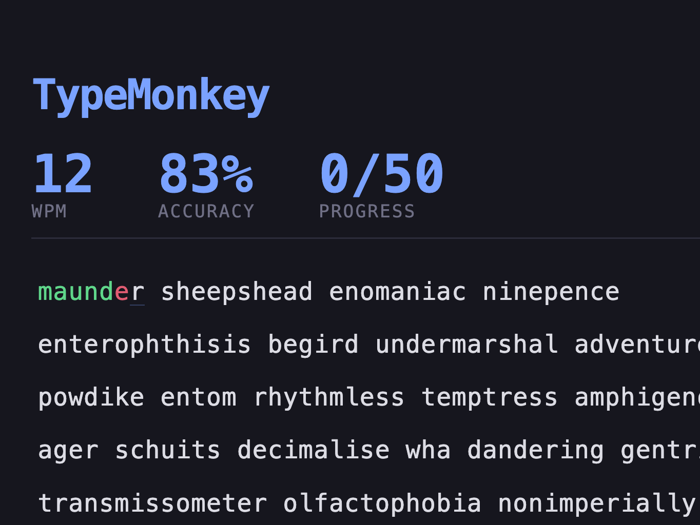

# 🐒 TypeMonkey

A fast, minimal typing trainer in the spirit of [MonkeyType](https://monkeytype.com) — built with [Tauri v2](https://tauri.app) and vanilla JS. No frameworks, no build step for the frontend, just words and a keyboard.



## Features

- ⚡ **Instant start** — just start typing; the timer begins on your first keystroke
- 📊 **Live stats** — net/gross WPM, accuracy, and word progress
- 🎯 **Hard words** — fetches a large word list, filters to rare 6–12 letter words, and caches them locally for 24h
- 🖱️ **Caret pinning** — the active line stays anchored in the viewport as you type
- 🔤 **Adjustable font size** — persisted between sessions
- 🪟 **Window size memory** — the window restores to its last size on launch
- 📴 **Offline-friendly** — falls back to a bundled word list if the network fails

## Controls

| Key | Action |
| --- | --- |
| `Tab` | New test |
| `Esc` | Restart current test |
| `Space` | Skip to next word |
| `Backspace` | Undo last character |

## Getting Started

### Prerequisites

- [Rust](https://rustup.rs)
- [Node.js](https://nodejs.org)
- Platform dependencies for Tauri: see the [Tauri prerequisites](https://tauri.app/start/prerequisites/)

### Run in development

```sh
npm install
npm run dev
```

This starts a local static server and launches the Tauri dev window with hot reload.

### Build a release binary

```sh
npm run build
```

The packaged app lands in `src-tauri/target/release/bundle/`.

## How It Works

```
index.html ── main.js ── worker.js ── remote-load-worker.js
   │              │            │
   │              │            └── fetches the word list over the network
   │              │
   │              └── localStorage (word cache + settings) lives on the
   │                  main thread, since web workers can't access it
   │
   └── Tauri (Rust) — window management, settings persistence
```

- **`main.js`** — game loop, rendering, keyboard handling, and all `localStorage` access (word cache + settings like font size and window dimensions)
- **`worker.js`** — orchestrates word loading: asks the main thread for cached words, tops up from the network, then picks a random set for the test
- **`remote-load-worker.js`** — fetches the raw word list off the main thread
- **`src-tauri/`** — the Rust side (window config, capabilities, icons)

## Project Structure

```
├── index.html            # single-page UI
├── main.js               # game logic + localStorage
├── worker.js             # word loading orchestration
├── remote-load-worker.js # network word fetch
├── styles.css            # theme + animations
└── src-tauri/            # Tauri (Rust) backend
```

## License

[MIT](./LICENSE)
